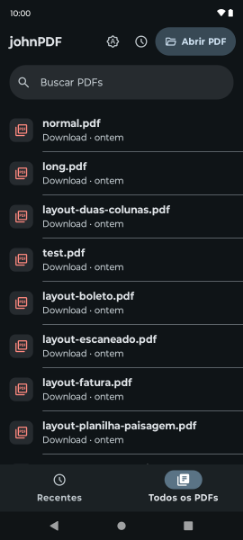
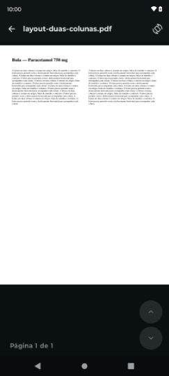

# johnPDF

[](LICENSE)
[](#requirements)
[](https://kotlinlang.org)
[](https://developer.android.com/jetpack/compose)

A free, ad-free, open source PDF reader for Android. No accounts, no trackers, no paywall — it opens your PDFs and gets out of the way.

<p align="center">
  
  
</p>

## Why johnPDF exists

My parents had been using a PDF reader on their phones for years. One day it updated and went paid — the app they relied on simply stopped working until someone paid for it. I went looking for a replacement and everything I found was worse: reader apps wrapped in full-screen ads, or free tiers that pushed a subscription every time you opened a file.

Reading a PDF is not a premium feature. So I spent two days building this in Kotlin: a reader that opens the file, renders it well, and asks for nothing. It is open source so that it cannot be taken away from anyone the way the original one was.

## Features

**Reading**
- Fast page rendering powered by [MuPDF](https://mupdf.com/)
- Pinch to zoom (1x–4x), double-tap to zoom, pan while zoomed
- Immersive mode — tap the page to hide the header, bottom bar, and system bars
- Per-page rotation lock
- Password-protected PDFs

**Finding your files**
- **Recents** tab for documents you have opened
- **All PDFs** tab listing the PDFs on your device
- Search by filename
- Source labels so you can tell where a file came from at a glance — WhatsApp, Downloads, or Documents
- Opens PDFs shared from other apps via the standard Android "open with" flow

**Interface**
- Material 3 design, built entirely in Jetpack Compose
- Light / Dark / Follow-system themes, cycled from a single button in the header
- English and Portuguese, picked automatically from your system language
- Optional update check against GitHub Releases — **off by default**, and it only ever tells you a new version exists; it never downloads or installs anything on its own

## Privacy

johnPDF has no analytics, no crash reporting, no advertising SDKs, and no user accounts. You can verify this — the dependency list is in [`gradle/libs.versions.toml`](gradle/libs.versions.toml).

Your documents never leave your device. Everything the app stores (recent files, theme, settings) is kept in local app storage.

The app requests three permissions:

| Permission | Why |
|---|---|
| `INTERNET` | Only to check GitHub Releases for a newer version, and only if you turn that setting on |
| `READ_EXTERNAL_STORAGE` (Android ≤ 12) | To list and open PDFs on your device |
| `MANAGE_EXTERNAL_STORAGE` | To find PDFs across your storage, including folders that apps like WhatsApp write to |

## Install

Download the latest APK from the [Releases page](https://github.com/JohnGabie/johnPDF/releases).

If a release offers more than one APK, they differ only by CPU architecture:

- `universal` — works on any device; **pick this one if unsure**
- `arm64-v8a` — almost every phone from the last several years, smaller download
- `armeabi-v7a` — older 32-bit devices
- `x86_64` — emulators

Android will warn you when installing an APK outside the Play Store. You will need to allow installation from your browser or file manager.

## Requirements

- Android 7.0 (API 24) or newer

To build it yourself:

- JDK 17
- Android SDK with API 36
- Gradle wrapper included (Gradle 8.11.1, AGP 8.10.1)

## Building from source

```bash
git clone https://github.com/JohnGabie/johnPDF.git
cd johnPDF
./gradlew assembleDebug
```

The APKs land in `app/build/outputs/apk/debug/`. Install one on a connected device:

```bash
adb install -r app/build/outputs/apk/debug/app-arm64-v8a-debug.apk
```

### Release builds

Release builds are signed from a `keystore.properties` file in the project root, which is git-ignored:

```properties
storeFile=/absolute/path/to/your.keystore
storePassword=…
keyAlias=…
keyPassword=…
```

Without that file the release build still runs, but produces unsigned APKs.

## Testing

```bash
./gradlew testDebugUnitTest        # unit tests (JUnit, Robolectric, Turbine)
./gradlew connectedAndroidTest     # instrumented tests, needs a device or emulator
```

Rendering and gesture behaviour are covered by instrumented tests because they depend on a real graphics stack.

## Project layout

```
app/src/main/java/com/johngabie/johnpdf/
├── data/       Repositories: recents, library, imports, settings, updates
├── engine/     PdfEngine abstraction + MuPDF implementation
├── ui/
│   ├── home/   Library and recents screens
│   ├── reader/ Reader screen, zoom and paging logic
│   ├── common/ Shared buttons and dialogs
│   └── theme/  Theming and theme persistence
└── util/       Date formatting, filename filtering
```

Dependencies are wired by hand in `AppContainer.kt` — the app is small enough that a DI framework would cost more than it saves.

## Contributing

Issues and pull requests are welcome.

A few things worth knowing before you start:

- Keep it ad-free and tracker-free. Any PR introducing advertising, analytics, or telemetry will be declined — that is the whole point of the project.
- Run `./gradlew testDebugUnitTest` before opening a PR.
- No user-facing string belongs in Kotlin. Add it to `res/values/strings.xml` and reference it with `stringResource(...)`.

### Adding a translation

English is the default and Portuguese ships alongside it. To add a language, copy `app/src/main/res/values/strings.xml` into `app/src/main/res/values-<code>/` and translate the values — for example `values-es` for Spanish.

Two entries are formatting patterns rather than prose:

- `date_pattern_same_year` and `date_pattern_other_year` are [`DateTimeFormatter`](https://developer.android.com/reference/java/time/format/DateTimeFormatter) patterns. English uses `MMM d`, Portuguese uses `d 'de' MMM`. Write whatever reads naturally in your language and quote any literal words.
- Strings containing `%1$s` or `%1$d` keep those placeholders, but you are free to reorder them.

Unit tests run pinned to `en-US` (see `app/src/test/resources/robolectric.properties`), so adding a language never breaks the suite.

## License

johnPDF is licensed under the **GNU Affero General Public License v3.0**. See [LICENSE](LICENSE).

This is a deliberate choice, and partly a required one: the app renders PDFs with [MuPDF](https://mupdf.com/), which is AGPL-licensed. The practical effect is that anyone who distributes a modified version of johnPDF must also publish their source under the same license. Nobody gets to take this code, close it, and charge for it.

## Acknowledgements

- [MuPDF](https://mupdf.com/) by Artifex Software — the rendering engine
- [Material Symbols](https://github.com/google/material-design-icons) by Google, Apache 2.0 — icons, see [NOTICE](NOTICE)
